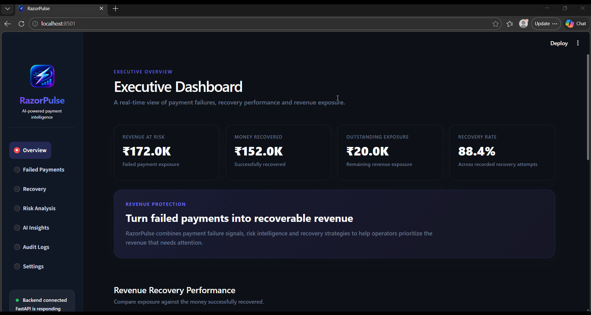

# RazorPulse

## AI-Powered Payment Recovery Platform

RazorPulse is an AI-powered payment recovery platform designed to help businesses intelligently recover failed payments while reducing manual intervention.

### 🚀 Key Features

* **AI-powered recovery recommendations**
* **Risk assessment for failed payments**
* **Automated recovery strategies**
* **Payment recovery tracking**
* **Manual review for high-risk cases**
* **Audit trail for recovery actions**
* **Real-time Streamlit dashboard**
* **FastAPI backend with SQLite persistence**

### 🏗️ Architecture

```text
User
  │
  ▼
Streamlit Dashboard
  │
  ▼
FastAPI Backend
  │
  ├── Risk Engine
  ├── Recovery Engine
  ├── AI Service
  └── Payment / Recovery Services
          │
          ▼
     SQLite Database
          │
          └── Invoices
              Recovery Attempts
              Audit Records

```
                    ┌──────────────────────┐
                    │      RazorPulse      │
                    │        User          │
                    └──────────┬───────────┘
                               │
                               ▼
                    ┌──────────────────────┐
                    │ Streamlit Dashboard  │
                    │    frontend/app.py    │
                    └──────────┬───────────┘
                               │ HTTP
                               ▼
                    ┌──────────────────────┐
                    │   FastAPI Backend    │
                    │      main.py         │
                    └──────────┬───────────┘
                               │
             ┌─────────────────┼─────────────────┐
             ▼                 ▼                 ▼
      ┌──────────────┐  ┌──────────────┐  ┌──────────────┐
      │  Risk Engine │  │Recovery Engine│ │  AI Service  │
      └──────┬───────┘  └──────┬───────┘  └──────┬───────┘
             │                 │                 │
             └─────────────────┼─────────────────┘
                               ▼
                    ┌──────────────────────┐
                    │ Recovery / Payment  │
                    │      Services       │
                    └──────────┬───────────┘
                               ▼
                    ┌──────────────────────┐
                    │    SQLite Database  │
                    │                      │
                    │ Invoices             │
                    │ Recovery Attempts    │
                    │ Audit Records        │
                    └──────────────────────┘

  

  

### 🛠️ Tech Stack

* Python
* FastAPI
* Streamlit
* SQLAlchemy
* SQLite
* AI / Risk & Recovery Engines

### ▶️ Running the Project

Start the FastAPI backend:

```bash
uvicorn backend.main:app --reload
```

Start the Streamlit dashboard:

```bash
streamlit run frontend/app.py
```

The dashboard provides visibility into invoices, payment recovery attempts, recovery status, and recovery amounts.

### 📊 Demo

The demo showcases:

1. Failed payment identification
2. Risk evaluation
3. Recovery strategy selection
4. Recovery execution
5. Audit tracking
6. Dashboard visibility

### 🎯 Goal

RazorPulse aims to make payment recovery **smarter, faster, and more transparent** by combining AI-driven decisions with automated recovery workflows and complete auditability.
